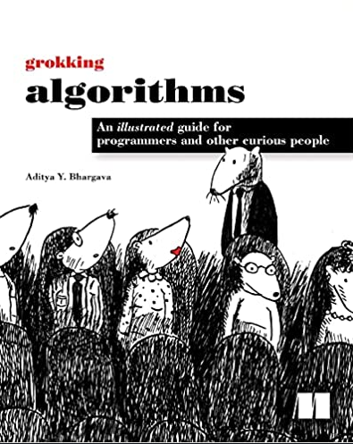

# Grokking Algorithms - Aditya Y. Bhargava

This repository contains implementations of various algorithms studied from the book "Grokking Algorithms" by Aditya Y. Bhargava. The purpose of this repository is to serve as a personal reference and portfolio, as well as to assist other developers and students in understanding and practically applying these algorithms.

